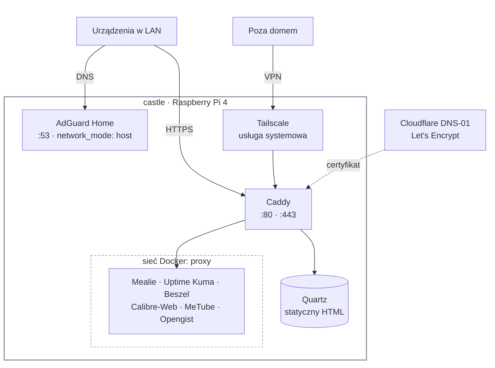

# Homelab


Konfiguracja domowego homelaba na jednym hoście. Wszystko, czego potrzeba
do odbudowy infrastruktury od zera: to repozytorium + kopia danych.

**Host:** `castle` — Raspberry Pi 4, 4 GB RAM, ARM64, Raspberry Pi OS Lite
(Debian trixie), adres `192.168.10.10`.



Każda usługa jest dostępna pod `https://<usługa>.home.figielak.dev`. Kontenery
aplikacyjne nie publikują portów na hoście, więc jedyną drogą do usług jest
Caddy. Świadome wyjątki, wszystkie w `network_mode: host`: **AdGuard** (DNS :53
i panel :3000), **`beszel-agent`** i **`dashboard-agent`** — oba agenty nie
słuchają na żadnym porcie. Pełny rejestr portów w
[`docs/hosts/castle.md`](docs/hosts/castle.md#rejestr-portów).

## Od czego zacząć

1. [`docs/hosts/castle.md`](docs/hosts/castle.md) — **najważniejszy plik**.
   Stan faktyczny hosta, rejestr portów, budżet RAM, dług techniczny, log zmian.
   Przeczytaj, zanim cokolwiek dołożysz.
2. [`docs/services/`](docs/services/) — notatka na usługę, z procedurą
   odtworzenia od zera.
3. [`CLAUDE.md`](CLAUDE.md) — zasady projektu i konwencje. Pisany jako
   instrukcja dla agenta AI (Claude Code), ale czyta się go jak regulamin
   repo — dla ludzi obowiązuje tak samo.

## Struktura

```
docs/            vault Obsidiana — hosts/, services/, decisions/
stacks/          jeden katalog = jeden docker-compose.yml
hosts/castle/    pliki systemowe hosta (ścieżka w repo = ścieżka na hoście)
scripts/         narzędzia, m.in. collect-host-state.sh
```

## Zasady, które trzymają to w kupie

- Konfiguracja w Git, **dane poza Git** (`/srv/homelab/data/<stack>/`)
- Bind mounts, nigdy named volumes
- Obrazy pinowane do wersji, nigdy `:latest`
- Sekrety w `.env` (w `.gitignore`), w repo tylko `.env.example`.
  Wartości (m.in. token Cloudflare dla DNS-01) są w menedżerze haseł —
  nazwę wpisu podaje notatka usługi w wierszu „Sekrety"
- Usługi wystawiane wyłącznie przez Caddy; kontenery nie publikują portów

Repo jest publiczne świadomie, razem z opisanym w `docs/` długiem technicznym.
Host ma tylko adres prywatny, SSH przyjmuje wyłącznie klucze, a z zewnątrz
dostęp daje jedynie Tailscale. Sekrety i raporty audytu nigdy nie trafiają do Git.

## Uruchomione usługi

| Usługa | Adres | Notatka |
|---|---|---|
| AdGuard Home | `adguard.home.figielak.dev` | [docs](docs/services/adguard.md) |
| Caddy | — (reverse proxy) | [docs](docs/services/caddy.md) |
| Mealie | `mealie.home.figielak.dev` | [docs](docs/services/mealie.md) |
| Tailscale | — (zdalny dostęp, na hoście) | [docs](docs/services/tailscale.md) |
| Uptime Kuma | `uptime-kuma.home.figielak.dev` | [docs](docs/services/uptime-kuma.md) |
| Beszel | `beszel.home.figielak.dev` | [docs](docs/services/beszel.md) |
| Dashboard agent | — (push na figielak.dev) | [docs](docs/services/dashboard-agent.md) |
| Calibre-Web | `calibre.home.figielak.dev` | [docs](docs/services/calibre-web.md) |
| MeTube | `metube.home.figielak.dev` | [docs](docs/services/metube.md) |
| Opengist | `opengist.home.figielak.dev` | [docs](docs/services/opengist.md) |
| Quartz | `quartz.home.figielak.dev` (strona z `docs/`) | [docs](docs/services/quartz.md) |

Domena wewnętrzna `*.home.figielak.dev` rozwiązywana przez AdGuard (DNS rewrite),
certyfikat wildcard od Let's Encrypt przez DNS-01 w Cloudflare. W Cloudflare
jest też publiczny wildcard `*.home → 192.168.10.10` (adres prywatny, więc
z internetu nieosiągalny). Poza domem dostęp daje Tailscale.

## Odbudowa od zera

Szkielet na wypadek utraty hosta. Szczegóły i komendy są w notatkach —
tu tylko kolejność, bo to ona jest nieoczywista.

1. **System:** Raspberry Pi OS Lite (64-bit) na SSD, boot z SSD, konto
   `figielak` z kluczem SSH — [`castle.md`](docs/hosts/castle.md).
2. **Pliki systemowe:** skopiować `hosts/castle/` w te same ścieżki na hoście
   (hardening SSH, `sysctl`), zrestartować `sshd`.
3. **Docker** i **Tailscale** z repozytoriów producentów —
   [`tailscale.md`](docs/services/tailscale.md).
4. **Repo:** deploy key read-only, `git clone` do `/opt/homelab`.
5. **Sieć:** `docker network create proxy` — raz na host, przed pierwszym stackiem.
6. **Stacki**, każdy według sekcji „Procedura odtworzenia" swojej notatki:
   najpierw **AdGuard** (DNS dla domu, potem wpis w routerze), potem **Caddy**,
   potem reszta w dowolnej kolejności.
7. **Dane:** przywrócić `/srv/homelab/data/<stack>/` z kopii **przed** pierwszym
   startem stacku.

> [!WARNING]
> Krok 7 dziś nie istnieje — **nie ma backupu** (czeka na HDD, krok 6
> wdrażania). Odbudowa odtworzy konfigurację, ale dane wpisane ręcznie
> (przepisy w Mealie, książki w Calibre-Web) przepadną. Procedura nie była
> też jeszcze przećwiczona na czystym sprzęcie.

## Dostarczanie zmian na hosta

Autorstwo zmian wyłącznie na laptopie. Host aktualizuje się przez:

```bash
cd /opt/homelab && git pull --ff-only
```

Deploy key jest read-only — Pi nigdy nie pushuje.

## Stan

Kroki 1–5 oraz 7–8 kolejności wdrażania zamknięte (baza, repo, AdGuard, Caddy,
Mealie, monitoring, Tailscale). Krok 6 (backup) czeka na HDD.

**Otwarte ryzyko: brak jakiegokolwiek backupu.** Szczegóły w długu technicznym
notatki hosta.
